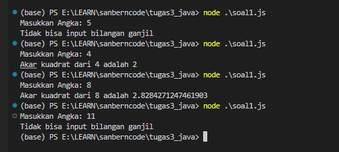
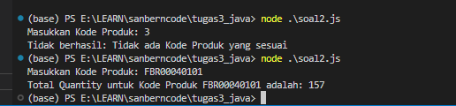

# TUGAS 3 JAVASCRIPT 
This Repository used for 3rd learning Java Quiz from Sanberncode 

## Task 1 
Create a square root program, to run this program you can use the following command:
```
    node soal1.js 
```
And enter numbers,  
```
    Masukkan Angka: 16
```
Noted: The number must be an even number and cannot be a negative number

This is the results of this program,


## Task 2 
Create a program to add up the quantity of the product code, to run this program you can use the following command:
```
    node soal2.js 
```
And enter the Product Code,  
```
    Masukkan Kode Produk: FBR00040101
```
This is the results of this program,
